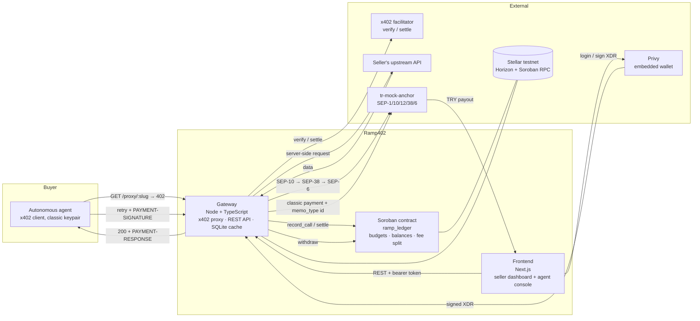

# Ramp402

**Pay-per-call payments for APIs, with a local-currency exit.**

Ramp402 puts an x402 payment gate in front of any existing HTTP API: autonomous agents pay per
request in USDC on Stellar, and the developer who owns the API withdraws the accumulated revenue to
Turkish lira through a Stellar anchor. The selling side and the getting-paid side are the same
product, not two.

- Live demo: https://ramp402.vercel.app/
- Gateway API: https://ramp402-production.up.railway.app/
- Contract (Soroban, testnet): `CC73BWETYN2PWAO6YPDLX4H75XUUMH4HDQQJMJYQPY2SW3PE2TEP4CVJ`
- Track: **Genesis**

---

## The problem

A developer in Türkiye can sell their API or data abroad. What they cannot do is get the money,
in lira, in their own bank account, quickly and cheaply. Today that path runs through a collection
provider: a percentage fee, an FX spread they do not control, and days of waiting.

At the same time, the buying side has its own friction. To call a paid endpoint once, a caller has
to register, get an API key, and set up a subscription — for a single request. That is a bad fit for
a script, for a cron job, and it is an impossible fit for an autonomous agent that discovers a
service at runtime.

x402 removes the friction on the buying side. An anchor removes it on the selling side. Ramp402 is
the product that connects the two:

```
agent pays per call (USDC, x402)  →  Ramp402  →  developer withdraws (TRY, SEP-6 anchor)
```

**Who pays us, and who benefits.** The 1% fee is paid by the *seller*, not the agent — and the
seller already pays for this exact service today, more expensively and more slowly. We are not
asking a new stakeholder to open their wallet; we are competing for a budget line that already
exists. The beneficiary is any developer, indie API author or data publisher who sells to
international callers and needs the proceeds locally.

**Target user:** developers and small teams who already have a working HTTP API and no way to
monetise it per request. Onboarding is an email login (Privy) and a form; no wallet, no key
management, no SDK to install, no change to their existing code.

**Global in, local out.** The paying side is global from day one — any agent, anywhere, with USDC.
Only the exit leg is Turkish, and that leg is discovered from the anchor's `stellar.toml`, never
hardcoded. A second country is a second home domain, not a second codebase.

---

## How the hackathon requirements are met

| Requirement | Our implementation | Why it is load-bearing |
| --- | --- | --- |
| **1. Integration** (SCF list) | **Privy** — email login, embedded Stellar wallet, seller signs `register_endpoint` and `withdraw` | Without it there is no onboarding and no seller signature; the whole seller side runs on it |
| **2. Anchor / Local payments** | **tr-mock-anchor** (SEP-1 / 10 / 12 / 38 / 6) — USDC → TRY off-ramp, live; TRY → USDC on-ramp exercised | It is the only exit for the revenue the gateway collects |
| **3. Core feature** | **x402 pay-per-call gateway** (x402 v2 on Stellar) | It is the product; everything else exists to serve it |
| Extra | **Soroban contract `ramp_ledger`**, deployed to testnet, 6 unit tests | Budget enforcement, revenue accounting and withdrawal authority live on chain |

The anchor is [tr-mock-anchor](https://github.com/kaankacar/tr-mock-anchor) by **Kaan Kaçar**; we
integrate it, we did not build it.

---

## What the product does, end to end

1. **Seller onboards.** Email login via Privy → an embedded Stellar wallet is created → the gateway
   funds that address via Friendbot so it exists as a ledger account and can sign.
2. **Seller registers an endpoint.** They paste their upstream URL and a per-call price. The gateway
   builds an unsigned Soroban transaction, Privy signs it, `register_endpoint` returns an on-chain
   `endpoint_id`, and the gateway hands back a protected proxy URL.
3. **An agent calls the proxy URL.** It gets `402 Payment Required` with the payment terms, retries
   with a signed payment, and receives `200 OK` with the upstream response.
4. **The agent runs out of budget.** Its budget was frozen on the first call for that
   (agent, endpoint) pair. The call that would exceed it is rejected *by the contract*, and the
   gateway returns `403` with the rejected transaction hash.
5. **Seller withdraws to lira.** One button: contract `withdraw` → SEP-10 auth → SEP-38 quote →
   SEP-6 withdraw → classic payment with `memo_type: id` → the anchor pays out and the transaction
   walks to `completed` with an `external_transaction_id`.

Demo economics (fixed, and chosen so the payout clears the anchor's 1 USDC floor):

| | |
| --- | --- |
| Price per call | 0.50 USDC (`5000000` stroops) |
| Agent budget | 1.75 USDC — the 4th call is rejected on chain |
| 3 successful calls | 1.50 USDC gross |
| Platform fee (1%) | 0.015 USDC |
| **Seller net** | **1.485 USDC** → withdrawn to TRY |

The FX rate is never hardcoded; it is read live from the anchor's SEP-38 quote.

---

## Architecture



### Components and responsibilities

| Component | Stack | Responsibility |
| --- | --- | --- |
| `contract/` | Rust, Soroban SDK | `ramp_ledger` — **a ledger only**. Records who spent what, enforces agent budgets, splits 1% / 99%, gates withdrawal authority. It never holds or moves tokens. |
| `gateway/` | Node, TypeScript, Express, better-sqlite3 | The x402 reverse proxy, the REST API, the anchor off-ramp (SEP-10/38/12/6), Privy token verification, Friendbot bootstrap. Signs contract writes with one "operator" keypair. |
| `frontend/` | Next.js, Privy | Seller dashboard (endpoints, live balance, call log, withdraw to TRY with status polling) and the agent console used to drive the demo. |
| `scripts/` | TypeScript | `setup`, `reset-demo`, `smoke-contract`, `verify-e2e`, `preflight`. |

**The chain is the source of truth for balances.** SQLite is a UI cache — endpoint list, call log,
seller↔Privy mapping, withdrawal history — and can be rebuilt without touching anyone's money.

### The x402 request flow in detail

1. Agent → `GET /proxy/:proxy_slug`.
2. Gateway → `402` with the `PAYMENT-REQUIRED` header: asset, amount, `payTo`.
3. Agent → retry with `PAYMENT-SIGNATURE`. On the first call for an (agent, endpoint) pair the
   `X-Agent-Budget` header is **mandatory**; missing it is a `400 missing_budget_header`. There is
   no default budget.
4. Gateway → facilitator `/verify`.
5. Gateway → contract `record_call`. If this spend would exceed the frozen budget the contract
   panics with `SpendingLimitExceeded`; the gateway returns `403 budget_exceeded` **and the hash of
   the rejected transaction**, so the refusal is verifiable on chain.
6. Gateway → server-side request to the seller's upstream API.
7. **Only if the upstream returned successfully:** facilitator `/settle`, then contract `settle`
   (1% treasury / 99% seller), then `200 OK` with `PAYMENT-RESPONSE`.
8. If the upstream failed, the call is recorded as `upstream_failed` with `tx_hash: null`, the agent
   is **not** charged, no revenue is credited, and the gateway returns `502`.

### `ramp_ledger` — storage and signatures

Persistent storage (TTL extended on every write):

```
NextEndpointId: u64
Endpoints:      Map<u64, EndpointInfo{ seller: Address, price: i128 }>
Budgets:        Map<(Address /*agent*/, u64 /*endpoint*/), BudgetEntry{ allocated, spent }>
SellerBalances: Map<Address, i128>
TreasuryTotal:  i128
```

| Function | Signed by | Notes |
| --- | --- | --- |
| `register_endpoint(seller, upstream_price) -> u64` | **Seller** (Privy) | The contract assigns the id; nobody else invents one |
| `record_call(operator, agent, endpoint_id, budget)` | **Gateway operator** | Budget frozen on first call; the parameter is ignored afterwards. Panics on overspend |
| `settle(operator, endpoint_id, amount)` | **Gateway operator** | 1% treasury, 99% seller. Rounding never favours the user |
| `withdraw(seller) -> i128` | **Seller** (Privy) | Zeroes the seller's balance. Only the seller can do this |
| `get_balance(seller) -> i128` | — | View, backs `GET /api/balance` |
| `get_endpoint(endpoint_id) -> EndpointInfo` | — | View |

Six unit tests, all green: id counter increments · budget frozen on first call · overspend panics ·
1%/99% split and rounding · unauthorised `withdraw` panics · balance is zero after `withdraw`. The
"a later, larger `X-Agent-Budget` must not raise the limit" case is a security property with its own
test.

### Stellar integrations and protocols used

| | |
| --- | --- |
| **Soroban** | `ramp_ledger`, deployed to testnet: `CC73BWETYN2PWAO6YPDLX4H75XUUMH4HDQQJMJYQPY2SW3PE2TEP4CVJ` |
| **x402 v2** | `@x402/core`, `@x402/express`, `@x402/fetch`, `@x402/stellar` — facilitator: https://x402.org/facilitator |
| **Privy** | Email login + embedded Stellar wallet; server-side access-token verification |
| **SEP-1** | Anchor discovery — every endpoint, the issuer and the signing key come from `stellar.toml` |
| **SEP-10** | Anchor authentication (JWT; re-auth automatically on 401) |
| **SEP-12** | KYC; the form is generated from the anchor's own `fields` response, not hardcoded |
| **SEP-38** | Live USDC→TRY quote; the rate is never written into the code |
| **SEP-6** | Withdraw (and deposit for the on-ramp leg), polled to `completed` |
| **Horizon / Soroban RPC** | Classic payment with `memo_type: id`, transaction submission, contract reads |
| **Friendbot** | Automatic funding of newly created seller accounts |
| Anchor home domain | `tr-mock-anchor.fly.dev` |
| USDC issuer (testnet) | `GBBD47IF6LWK7P7MDEVSCWR7DPUWV3NY3DTQEVFL4NAT4AQH3ZLLFLA5` |
| Network | Stellar **testnet** |

Nothing that `stellar.toml` can tell us is hardcoded: issuer, endpoints and limits are all read from
the anchor at runtime.

---

## Key design decisions and trade-offs

**The budget lives in our contract, not in a smart-account policy.** The obvious design is an
OpenZeppelin smart account with a spending-limit policy, so the payment itself is refused on chain.
It does not work today: `@x402/stellar` cannot pay from a Soroban smart account — it treats the
`C…` address as an ed25519 public key ([x402#3158](https://github.com/x402-foundation/x402/issues/3158)) —
and the default 50,000-stroop fee rejects a payer whose `__check_auth` calls another contract
([x402#3515](https://github.com/x402-foundation/x402/issues/3515)). We timeboxed the attempt, then
moved the limit into `record_call`. Trade-off: the refusal happens one step later, in our ledger
instead of in the payment itself — but it is still on chain, still enforced by contract code, and
still produces a transaction hash the agent can verify.

**The contract never holds funds. It is a ledger; the pool is custodial.** `payTo` is a classic
platform collection account. Two reasons, both practical: a Soroban contract has no "funds received"
hook for SAC transfers, so it could not split a payment it was handed; and a contract-originated
transfer arrives as `invoke_host_function`, which the anchor's Horizon watcher cannot match against
`memo_type: id`, so the withdrawal would hang forever. We say the word **custodial** plainly — MVP
revenue sits in a platform pool, and the contract holds the accounting and the withdrawal
authority, not the money. The roadmap fix is `payTo` set to the seller's own address with a periodic
fee batch.

**The anchor is always paid with a classic payment operation and `memo_type: id`** — never a
contract call, never a text memo. This is what makes the payout matchable.

**The gateway is a trusted operator, and here is exactly what that means.** `record_call` and
`settle` are signed by a single operator keypair so the agent does not have to sign twice per
request. The payment itself is verified cryptographically by the facilitator. So a malicious gateway
could misattribute a call to the wrong agent — it could **not** forge a payment or mint a balance —
and the seller's money can only be moved by the seller's own signature.

**No sessions.** The budget is keyed on (agent, endpoint) and frozen on the first call. A session
layer would have meant extra state in both the contract and the gateway, extra concurrency failure
modes, and an identifier the agent has to carry — for nothing that x402's stateless model needs.

**x402 rather than an MPP session.** A single call should not require opening a session or
pre-funding one. High-frequency callers are exactly what MPP Session is for, and that is on the
roadmap; the first-call case is not.

**One integration, on purpose.** We could have bolted on a second protocol for the requirement
table. Instead we spent that time making every failure state of the existing flow real —
`upstream_failed`, `budget_exceeded`, `pending_trust`, expired JWT, expired quote. The state machine
is the product, not the happy path.

**SQLite as the off-chain store.** A JSON file would race under parallel calls during the demo; a
real database would be setup cost for a single-process backend. Balance integrity does not depend on
it either way — the chain is authoritative.

---

## Technical challenges and how we solved them

| Challenge | Resolution |
| --- | --- |
| x402 on Stellar speaks **v2 only** — there is no v1 entry for Stellar at the facilitator | Headers are `PAYMENT-REQUIRED` / `PAYMENT-SIGNATURE` / `PAYMENT-RESPONSE`, not the v1 `X-PAYMENT` names. Package versions are pinned, because the facilitator's protocol version is coupled to them |
| On-chain budget enforcement with smart accounts unavailable (#3158 / #3515) | Budget moved into `record_call`; rejection returns 403 plus the rejected transaction hash |
| A Privy embedded wallet is a keypair, not a funded Stellar account — so `require_auth()` fails | The gateway funds new sellers via Friendbot during bootstrap. The user never sees this step; it is what keeps onboarding to seconds |
| Payment taken, upstream API down | Real state, not an edge case: `settle` moved to *after* a successful upstream response. The agent is not charged, the row is stored as `upstream_failed` with `tx_hash: null`, the gateway returns 502 |
| Contract payment invisible to the anchor | All anchor-bound USDC leaves as a classic payment with `memo_type: id` |
| KYC fields differ between anchors | The SEP-12 form is rendered from the anchor's returned `fields` map. Nothing about the form is hardcoded, which is also what makes the flow portable to another anchor |
| Soroban `persistent` storage expiring mid-demo | TTL is extended on every contract write |
| Seller's upstream credentials | Stored encrypted, decrypted only inside the proxy process. A seller who does not want that can self-host the gateway; an SDK is on the roadmap |

---

## What is real and what is simulated

We would rather say this than have it discovered.

- **Real:** the Stellar side. Real testnet USDC, real x402 payments verified by the facilitator, a
  real Soroban contract with real transaction hashes, real SEP-1/10/12/38/6 calls against a live
  anchor, real classic payments with memos.
- **Simulated:** the bank leg and KYC. tr-mock-anchor is a test anchor — it approves KYC
  automatically and simulates the TRY transfer. Mock-only code paths are isolated and marked
  `// MOCK ANCHOR ONLY`.
- **Custodial:** MVP revenue sits in a platform collection account until the seller withdraws.
- **Testnet:** nothing here runs on mainnet. Going to mainnet means a licensed anchor, a bank
  relationship and real KYC — an institution we do not operate. The integration code is portable;
  the anchor is not a config value.

---

## Getting started

Requirements: Node 22 or newer (see the note below), Rust with the `wasm32v1-none` target,
`stellar` CLI, a Privy app.

```bash
git clone https://github.com/SweetieBirdX/ramp402.git
cd ramp402

# 1) contract
cd contract
cargo test
stellar contract build
# deploy to testnet, note the contract id

# 2) gateway
cd ../gateway
cp .env.example .env     # fill in: CONTRACT_ID, OPERATOR_SECRET, PRIVY_APP_ID,
                         # PRIVY_APP_SECRET, ANCHOR_HOME_DOMAIN, FACILITATOR_URL, ALLOWED_ORIGINS
npm install
npm test
npm run dev

# 3) frontend
cd ../frontend
cp .env.local.example .env.local   # NEXT_PUBLIC_GATEWAY_URL, NEXT_PUBLIC_PRIVY_APP_ID
npm install
npm run check
npm run dev

# 4) one-time environment setup (accounts, trustline, treasury, demo endpoint)
npx tsx scripts/setup.ts
```

> **Node version.** `gateway/package.json` pins `"engines": { "node": ">=22" }`, and the deployed
> gateway follows the same pin via `railway.json`. This is not cosmetic: `better-sqlite3@13.0.3` is
> a native module whose prebuilt binary is compiled against a specific Node ABI (v22 is ABI 127), so
> a runtime on a different major would fall back to compiling from source and need Python and a
> build toolchain. We develop and deploy on v22.16.0. Note that `engines` is advisory — npm only
> warns unless `engine-strict` is set — so check `node -v` before reporting a native-module install
> failure.

Pinned versions verified end to end: `@x402/*` `2.26.0`, `@stellar/stellar-sdk` `17.1.0`.

### Verification

Every component verifies itself with one command:

| Command | What it proves |
| --- | --- |
| `cd contract && cargo test` | The six contract unit tests |
| `npx tsx scripts/smoke-contract.ts` | The **deployed** contract works on chain: register → record → settle → balance → withdraw |
| `cd gateway && npm test` | Route contract, budget logic, error codes |
| `cd frontend && npm run check` | Typecheck, lint, production build |
| `npx tsx scripts/verify-e2e.ts` | The full four-step demo over the live API, PASS/FAIL per step |
| `npx tsx scripts/preflight.ts` | Submission readiness: no leaked secrets, the README's contract id really is deployed, env complete, live URLs responding |
| `npx tsx scripts/reset-demo.ts` | Resets the demo state between runs |

---

## Deployed artifacts

| | |
| --- | --- |
| Frontend (live demo) | https://ramp402.vercel.app/ |
| Gateway API | https://ramp402-production.up.railway.app/ (`/health` → `{ ok: true }`) |
| `ramp_ledger` contract id | `CC73BWETYN2PWAO6YPDLX4H75XUUMH4HDQQJMJYQPY2SW3PE2TEP4CVJ` |
| Contract on explorer | https://stellar.expert/explorer/testnet/contract/CC73BWETYN2PWAO6YPDLX4H75XUUMH4HDQQJMJYQPY2SW3PE2TEP4CVJ |
| x402 facilitator | https://x402.org/facilitator |
| Anchor home domain | `https://tr-mock-anchor.fly.dev` |
| Platform collection account | `GA6UDAI55VG36CM7SQSKOVWL4AAHYYOBJSS4JPYUJME5ILMJP235JYQB` |
| Network | Stellar testnet |

---

## Where the demand comes from, and what comes next

We make no traction claim. Nobody onboarded onto the live gateway during the event, and we would
rather say that than inflate a number.

What the idea rests on instead is that it does not require a new market to appear first. The
developers we built this for already sell abroad and already pay to get that money home: a
percentage fee to a collection provider, an FX spread they do not control, and days of waiting for
a settlement they cannot see. That is an existing budget line with an existing bill attached, not a
stakeholder who has to be talked into caring. The same holds on the buying side — paying per request
without an account or a subscription is useful to a script or a cron job today, and autonomous
agents are the sharpest case of that friction rather than the only one.

So the bet is not "agents will start paying for APIs one day". It is that a cost people are paying
right now can be paid less of, on a rail they can watch settle.

Next steps, in order:

1. **InstAward** application immediately after the event.
2. **SCF Build Award — Integration Track** as the intended funding path, building on the Privy
   integration and the anchor flow shipped here.
3. Licensed anchor and a non-custodial `payTo`: revenue routed straight to the seller's address with
   a periodic fee batch.
4. `@ramp402/gateway-sdk` so a seller can self-host the proxy and keep their own upstream keys.
5. MPP Session for high-frequency callers, alongside the per-call x402 path.
6. A second exit country — same code, different home domain — and a swap layer for routing between
   issuers.

The team shipped this in 36 hours across three parallel workstreams with a shared conventions
document, folder ownership and automated verification; the same process carries into the next
milestone.

---

## Stellar skills used

We installed the official [`stellar/stellar-dev-skill`](https://github.com/stellar/stellar-dev-skill)
plugin (`stellar-dev` v1.2.0) at the start of the build and worked from it. These are the skill
files the project draws on, by area:

| Path | Drawn on for |
| --- | --- |
| `skills/smart-contracts/SKILL.md` | Soroban contract patterns, persistent storage and TTL extension in `ramp_ledger` |
| `skills/standards/SKILL.md` | Choosing and reading the right SEPs for the anchor leg — SEP-1 discovery, SEP-10 auth, SEP-12 KYC fields, SEP-38 quotes, SEP-6 withdraw |
| `skills/agentic-payments/SKILL.md` | The x402 flow and its header semantics |
| `skills/dapp/SKILL.md` | Privy signing and the frontend wallet flow |
| `skills/assets/SKILL.md` | Trustlines, `pending_trust` and claimable balances |
| `skills/data/SKILL.md` | Horizon / RPC queries and matching the anchor payout by memo |

Paths are relative to the plugin's own repository. The plugin also ships `cross-chain` and
`zk-proofs`; neither is relevant to Ramp402 and neither was used.

We also used the **Raven** MCP server (`https://raven.stellar.buzz/mcp`) to query live Stellar
documentation rather than rely on remembered details.

---

## Team

**Ramp402** — Genesis Track

| Name | Role | Contact |
| --- | --- | --- |
| Eyüp Efe Karakoca | Team lead · Soroban contract, repo | [GitHub](https://github.com/SweetieBirdX) · [LinkedIn](https://www.linkedin.com/in/eyupefekarakoca/) · [X](https://x.com/EyupEfeKrkc) |
| Ömer Altundağ | Gateway, x402 flow, anchor integration | [GitHub](https://github.com/OmerAltundagX) · [LinkedIn](https://www.linkedin.com/in/ömer-altundağ-424179399) · [X](https://x.com/OmerA34361) |
| Mert Ahmet Bayazıt | Frontend, seller dashboard, agent console | [GitHub](https://github.com/MertBayazit) · [LinkedIn](https://www.linkedin.com/in/mertahmetbayazit7a9841320/) |

## License

MIT — see [`LICENSE`](LICENSE).